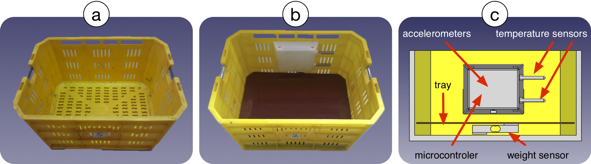

# SMARTBINS FOR BERRIES HARVEST

This project aims to build a monitoring system for berries harvest based on sensor networks. We propose a novelty approach based on sensors data to track the berries harvesting stages. Our findings confirm that machine learning analysis of vibrations, temperature, and weight inside the harvest basket allows predicting in which harvest stage is the basket with an accuracy of about 80%. Tracking the harvesting process using our "smart-bins" is an exciting aspect for berries producers because this information can help to improve harvesting logistics and reduce fruit damage extending its shelf life, being later crucial when the target markets are very distant.

Click this  logo to launch Jupyter Notebook (*jupyter/Testing-Different-ML-Algorithms-for-Harvest Stage-Prediction.ipynb*) with the model to recognize the harvest stages based on sensor's data.
